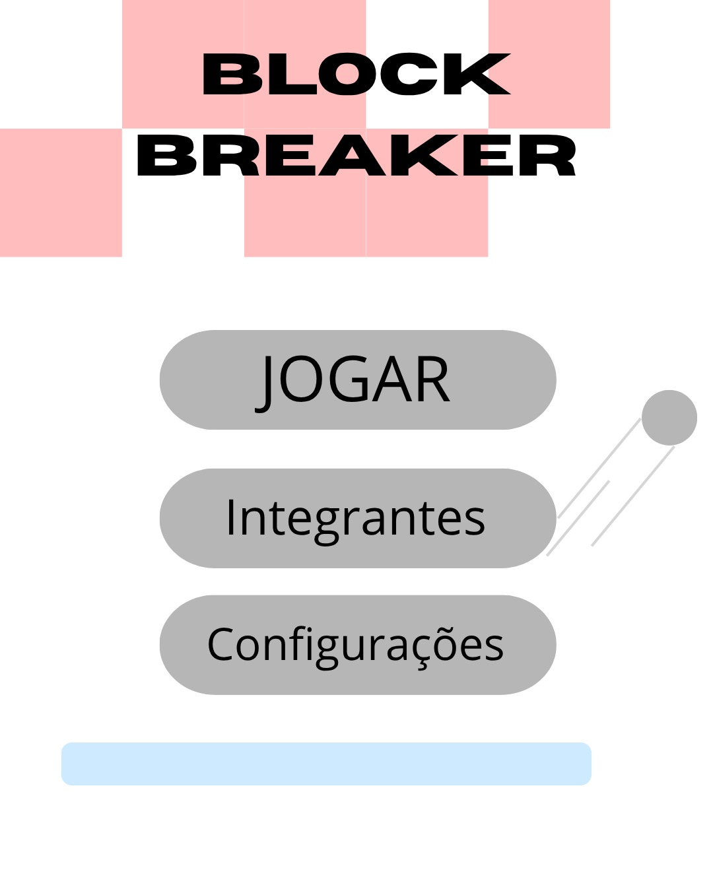
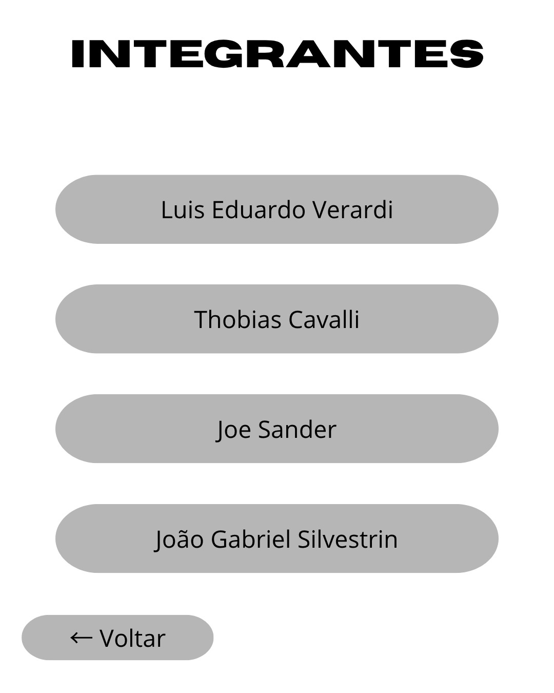
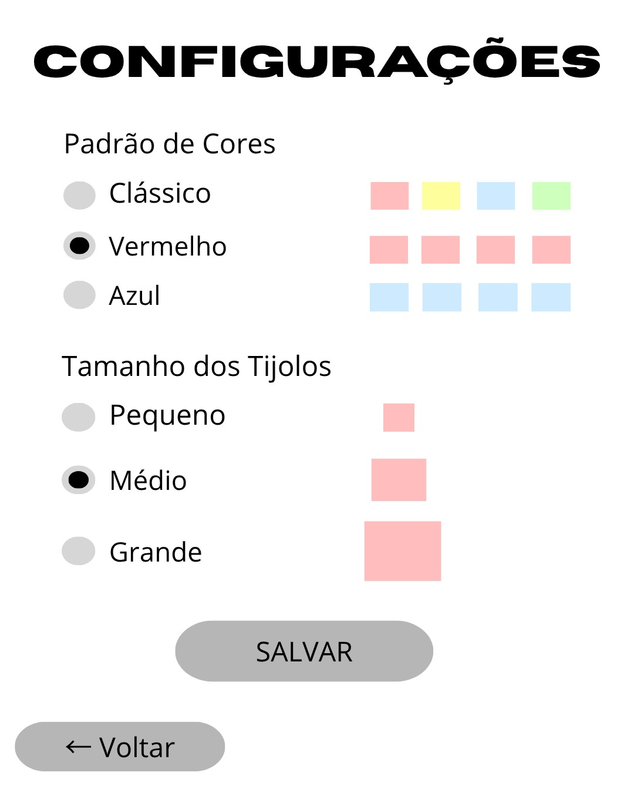
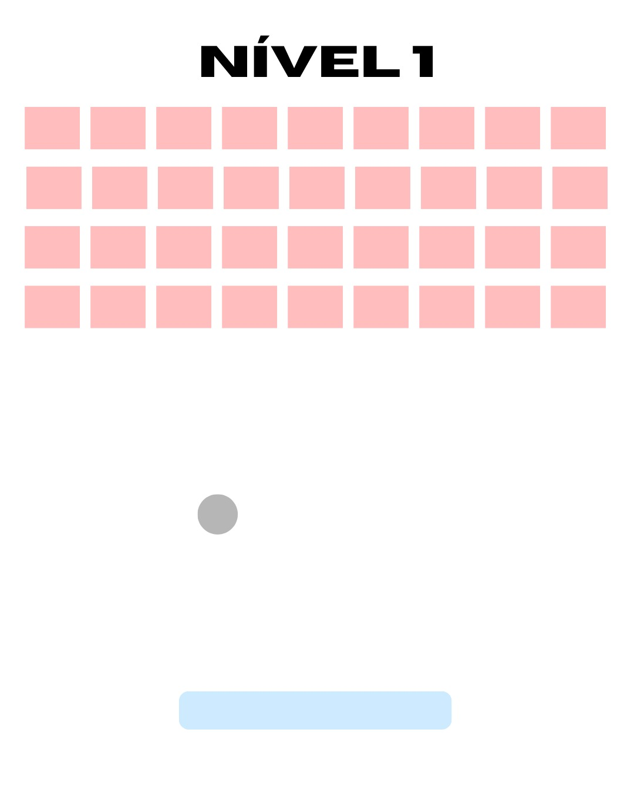
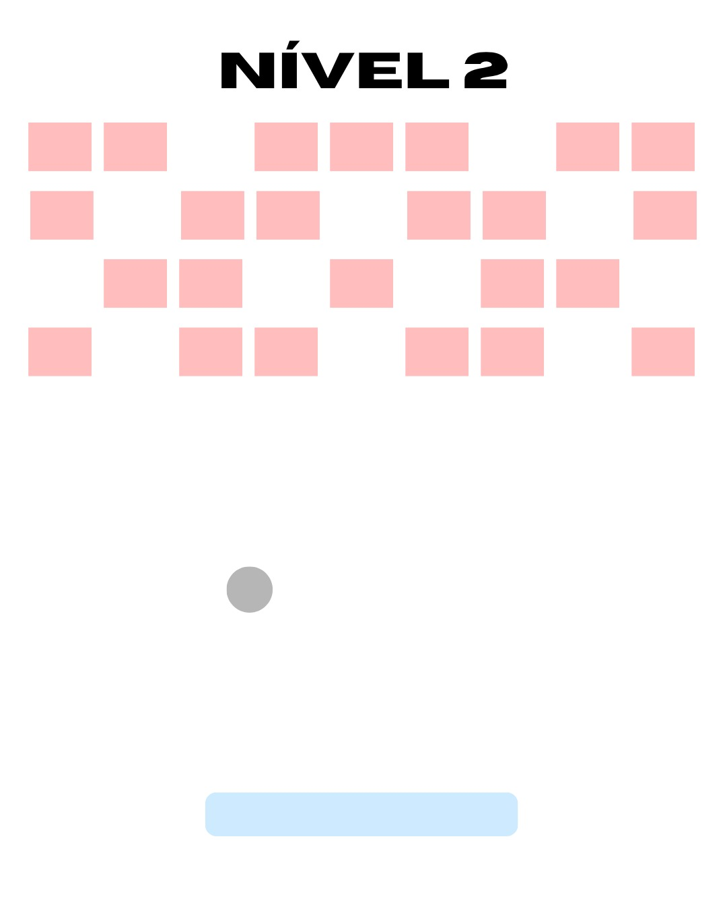
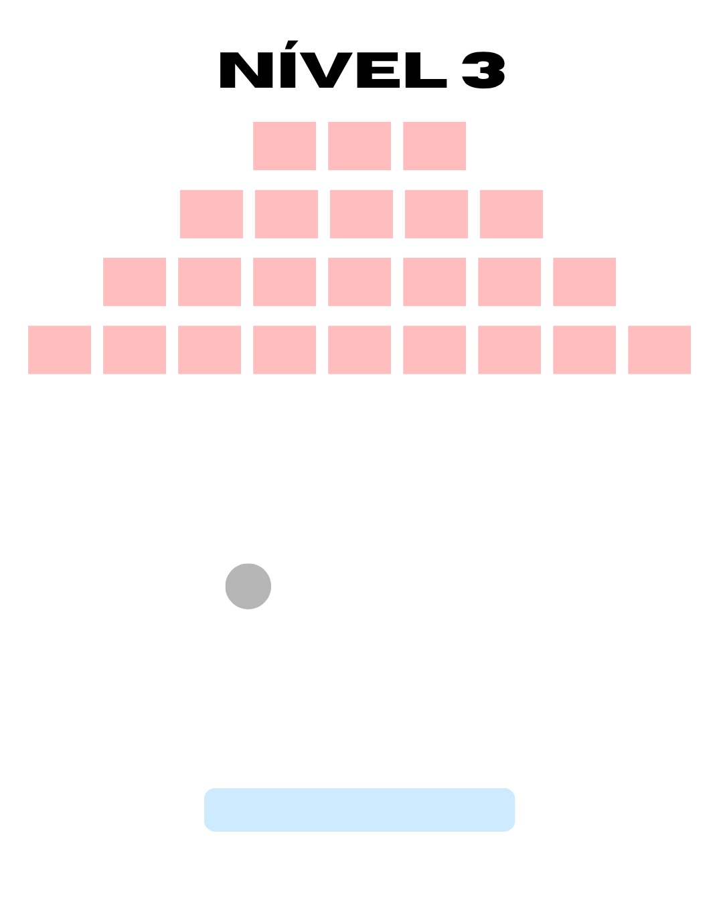
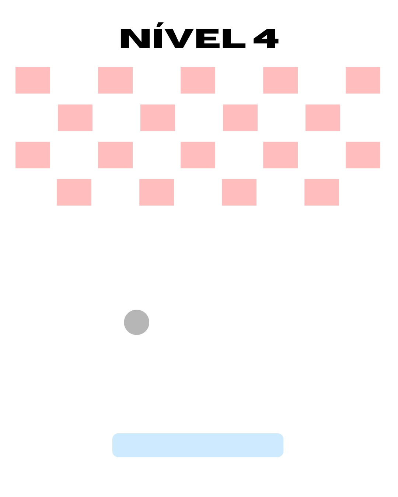
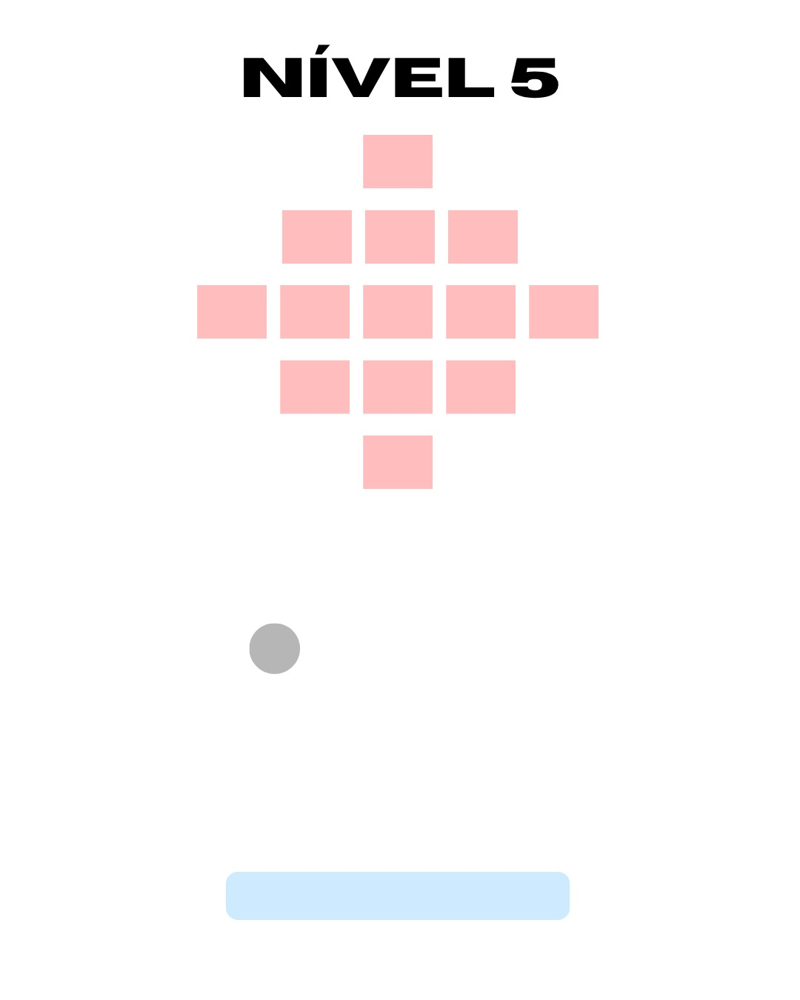

Wireframes do Aplicativo

Os wireframes apresentados neste documento representam o planejamento das telas do aplicativo **Brick Breaker**. Eles demonstram a organização dos componentes, as opções disponíveis ao usuário e a disposição dos elementos utilizados durante o jogo.

Tela Inicial

A tela inicial apresenta as três principais opções do aplicativo:

* **Jogar:** inicia o jogo;
* **Integrantes:** acessa a tela com os integrantes do grupo;
* **Configurações:** permite configurar características dos tijolos utilizados no jogo.

Tela de Integrantes

A tela de integrantes apresenta o nome e sobrenome dos integrantes responsáveis pelo desenvolvimento do projeto.

O botão **Voltar** permite retornar à tela inicial.

Tela de Configurações

A tela de configurações permite definir características que serão utilizadas na construção das paredes de tijolos.

O usuário poderá selecionar:

* o padrão de cores dos tijolos;
* o tamanho dos tijolos.

Foram definidos inicialmente três padrões de cores: **Clássico, Vermelho e Azul**.

Para o tamanho dos tijolos, estão disponíveis as opções **Pequeno, Médio e Grande**.

Após realizar as escolhas, o usuário poderá utilizar a opção **Salvar** para aplicar as configurações.

Nível 1

O primeiro nível apresenta uma parede completamente preenchida, formando uma estrutura regular de tijolos.

Nível 2

O segundo nível apresenta uma parede com espaços vazios entre determinadas posições, criando uma disposição diferente da utilizada no primeiro nível.

Nível 3

O terceiro nível apresenta os tijolos organizados no formato de uma pirâmide.

Nível 4

O quarto nível utiliza uma disposição alternada dos tijolos, deixando espaços entre os blocos e formando um novo padrão para a parede.

Nível 5

O quinto nível apresenta os tijolos organizados no formato de um losango, criando uma disposição diferente dos níveis anteriores.

Game Over

Quando a bola ultrapassar a plataforma sem ocorrer a colisão, será apresentada a tela de **Game Over**.

Nessa situação, o jogador poderá:

* **Reiniciar Nível:** iniciar novamente o nível atual;
* **Próximo Nível:** avançar diretamente para o próximo nível;
* **Voltar ao Menu:** retornar à tela inicial do aplicativo.

